# max-draw

Converts Max patcher files in JSON format to SVG images.

Work in progress, supported features:

- Text-like box objects, message boxes, `toggle`, `button`, `number`, `flonum`, `inlet`, `outlet`
- Signal and event cables, with custom colors and bend points
- Resized objects

Features will be added as I need them while I'm taking notes on Max. Mostly documenting DSP code written in gen, so not many graphical objects are supported yet.

Not sure if I want this to be used more like a web component or a offline converter tool, but there's a little test CLI you can use with a typescript runner:

`npx tsx src/cli.ts "path/patcher.maxpat" > "path/output.svg"`

## Sample Output

Simple gen patcher:

More objects (blank box in bottom left is an unimplemented `[ezdac~]`):

